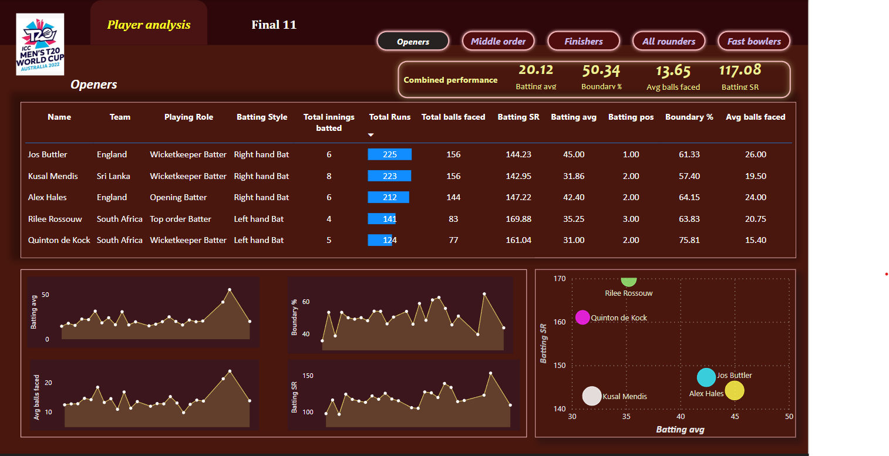

# T20WC_2022-Best-11
Here we have collected entire 2022 T20 World cup data to finalise best 11 players who can win any team in a T20 match.
## Setup
Here I have used Power BI to build dashboards which will showcase every players performance throughout the 2022 Worldcup, based on their performance we would have finalised Best 11 players. 
## Datasets used
Created own datasets using web-scraping
## Process involved in finalizing best 11 players
  1. Web scraping:
        I used Python Webscraping to scrape Match results, Batting statistics, Bowling Statsitics and Player info from Espncricinfo website and saved them as JSON           files.
  2. Python Pandas:
        I used Pandas to perform data cleaning and preprocessing on the JSON files that we got from above steps and saved them as CSV files.
  3. Power BI:
        Power BI is used to build dashboards using preprocessed CSV files to showcase players performance and finalise Best 11 players that played 2022 T20 World             Cup.
        
  Dashboard will look like:
  
  
  
  Final dashboard: <a href = "https://www.novypro.com/project/t20wc-2022---best-11">T20WC Best 11</a>
